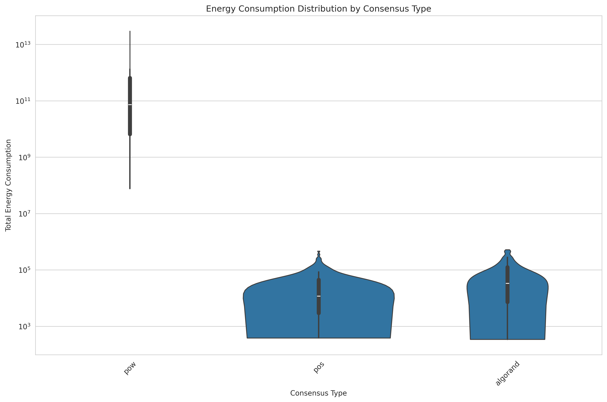
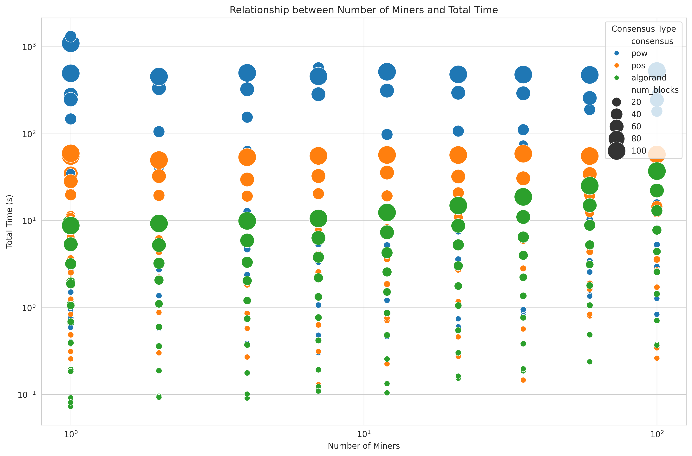
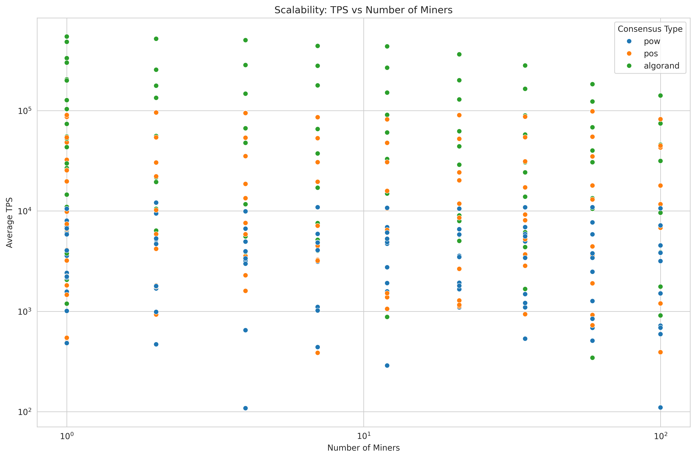
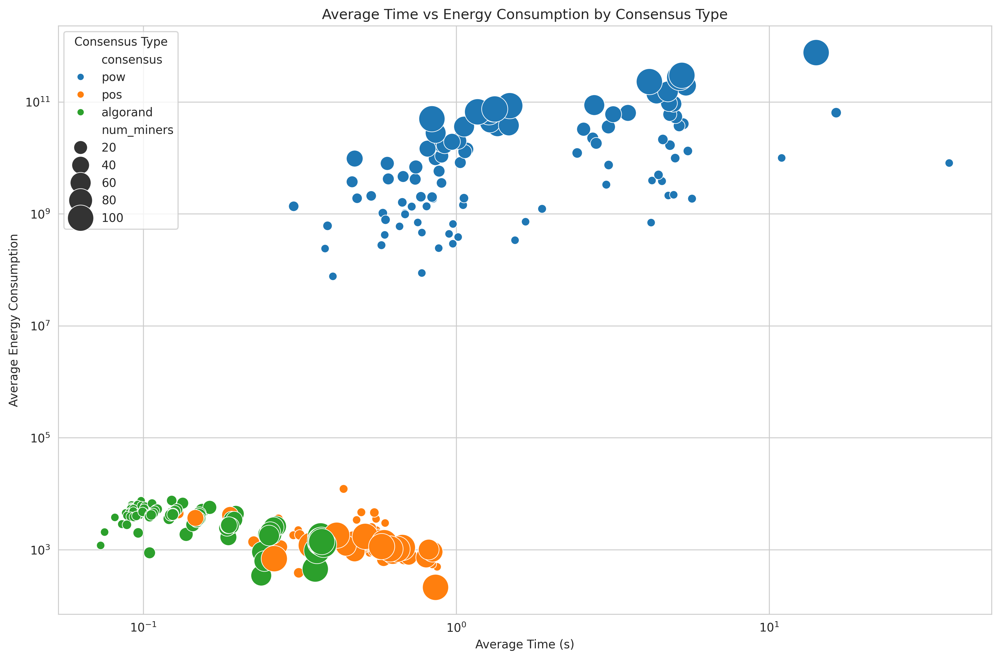

# blockchain-consensus

## Efficiency Comparison (TPS/Energy) by Consensus Type

The bar graph shows the efficiency comparison (in terms of Transactions Per Second (TPS) per unit of energy) across three different consensus types: PoW (Proof-of-Work), PoS (Proof-of-Stake), and Algorand.

Key observations:

- The efficiency of Algorand is significantly higher than both PoW and PoS, as indicated by the much taller blue bar for Algorand compared to the other two.
- The efficiency of PoS is also higher than that of PoW, but the difference is not as dramatic as the gap between Algorand and the other two.
- The y-axis is on a logarithmic scale, which means the differences in efficiency between the consensus types are quite substantial. For example, the efficiency of Algorand appears to be around 3-4 orders of magnitude higher than that of PoW.

This plot suggests that Algorand is the most efficient consensus mechanism in terms of the ratio of TPS to energy consumption, outperforming both PoW and PoS by a large margin. This is an important consideration for blockchain applications where energy efficiency and scalability are crucial factors.

The stark contrast in efficiency between the consensus types highlights the need to carefully evaluate the trade-offs and select the most appropriate consensus mechanism that aligns with the specific requirements and constraints of the blockchain application.

## Energy Consumption Distribution by Consensus Type

The image shows the distribution of energy consumption for three different consensus types: PoW (Proof-of-Work), PoS (Proof-of-Stake), and Algorand.

Key observations:

- The distribution for PoW has a much wider spread and a significantly higher peak compared to the other two consensus types. This indicates that PoW has a higher overall energy consumption and a wider range of energy usage values.
- The distribution for PoS is narrower and more concentrated, suggesting a lower overall energy consumption and less variability in energy usage compared to PoW.
- The distribution for Algorand is also narrower and more concentrated, with the lowest overall energy consumption among the three consensus types.

The violin plots provide a clear visual representation of the differences in energy consumption patterns across the consensus mechanisms. PoW exhibits the highest and most variable energy consumption, while PoS and Algorand show progressively lower and more consistent energy usage.

This information is crucial when evaluating the sustainability and scalability of blockchain networks, as energy consumption is a critical factor in the selection of an appropriate consensus mechanism. The data suggests that Algorand may be the most energy-efficient choice among the three, which could be an important consideration for blockchain applications with stringent energy requirements.

## Relationship between Number of Miners and Total Time

The image shows the relationship between the number of miners and the total time required to complete the blockchain network operations. This is an important aspect of understanding the scalability of different consensus mechanisms.
Key observations:

- The x-axis represents the number of miners on a logarithmic scale, ranging from 100 to 10,000.
- The y-axis shows the total time required, also on a logarithmic scale, ranging from 0.1 seconds to 1000 seconds.
- The data points are color-coded based on the consensus type (PoW, PoS, or Algorand) and sized based on the number of blocks processed.
- For PoW, the data points are generally clustered in the top-left region, indicating higher total time and fewer miners.
- The PoS and Algorand data points are more evenly distributed, suggesting these consensus mechanisms can handle a wider range of miner counts with lower total time.
- As the number of miners increases, the total time tends to decrease for all consensus types, indicating improved scalability with more miners.
- However, the rate of improvement and the overall performance vary significantly between the consensus mechanisms, with Algorand showing the best scalability.

This plot provides valuable insights into how the number of miners impacts the total time required for the blockchain network to operate. It highlights the differences in scalability between PoW, PoS, and Algorand, with Algorand demonstrating the most favorable relationship between miner count and total time. This information is crucial when selecting the appropriate consensus mechanism for a blockchain application that requires efficient and scalable performance.

## Total Rewards vs Hash Rate/Stake by Consensus Type

The image shows the relationship between the total rewards received by participants and their hash rate (for Proof-of-Work) or stake (for Proof-of-Stake and Algorand) across the three consensus types: PoW, PoS, and Algorand.

Key observations:

- The x-axis represents the hash rate (for PoW) or stake (for PoS and Algorand) on a logarithmic scale, ranging from 10^6 to 10^18.
- The y-axis shows the total rewards received by the participants, also on a logarithmic scale, ranging from 10^-4 to 10^4.
- The data points are color-coded based on the consensus type, with blue for PoW (hash rate), orange for PoS (stake), and green for Algorand (stake).
- For PoW, the data points form a clear and relatively linear relationship between hash rate and total rewards, suggesting a direct correlation between the two.
- The PoS and Algorand data points exhibit a more scattered pattern, indicating a less direct relationship between stake and total rewards.
- The PoS and Algorand data points appear to have a higher concentration at the lower end of the stake spectrum, while the PoW data points are more evenly distributed across the hash rate range.

This plot provides insights into the different reward structures and incentive mechanisms employed by the three consensus mechanisms. The linear relationship for PoW suggests a more straightforward reward system based on hash rate, while the more scattered patterns for PoS and Algorand suggest more complex reward dynamics that may involve factors beyond just the stake.

The differences in the distribution and trends of the data points can help researchers and developers understand the incentive structures and participation dynamics of each consensus type, which is crucial for designing effective and fair blockchain systems.

## Scalability: TPS vs Number of Miners

The image shows the relationship between the number of miners and the average transactions per second (TPS) for the three consensus types: PoW, PoS, and Algorand.

Key observations:

- The x-axis represents the number of miners on a logarithmic scale, ranging from 10 to 10,000.
- The y-axis shows the average TPS, also on a logarithmic scale, ranging from 100 to 100,000.
- The data points are color-coded based on the consensus type, with blue for PoW, orange for PoS, and green for Algorand.
- For PoW, the data points are clustered in the lower left region, indicating relatively lower TPS and fewer miners.
- The PoS and Algorand data points are more widely distributed, covering a larger range of both miner counts and TPS values.
- As the number of miners increases, the average TPS tends to increase for all consensus types, suggesting improved scalability.
- However, the rate of improvement and the overall TPS levels vary significantly between the consensus mechanisms, with Algorand demonstrating the best scalability, followed by PoS and then PoW.

This plot provides valuable insights into the scalability of the different consensus mechanisms. It highlights the ability of each consensus type to handle increasing transaction volumes as the network size grows. The superior performance of Algorand in terms of achieving higher TPS with a larger number of miners suggests that it may be the most scalable option among the three consensus types examined.

This information is crucial for blockchain applications that require high throughput and the ability to scale effectively as the network expands. The comparative analysis of the consensus types can help developers and decision-makers select the most appropriate consensus mechanism that aligns with their scalability requirements.

## Average Time vs Energy Consumption by Consensus Type

This scatter plot illustrates the relationship between average time and average energy consumption for three different consensus mechanisms: Proof of Work (PoW), Proof of Stake (PoS), and Algorand:

- Energy Efficiency:
  - PoW consumes significantly more energy (10^8 to 10^12 units) compared to PoS and Algorand (10^3 to 10^4 units).
  - PoS and Algorand are substantially more energy-efficient, using about 4-5 orders of magnitude less energy than PoW.
- Transaction Speed:
  - PoW generally has longer average times (1 to 100 seconds).
  - PoS and Algorand have faster transaction times, mostly between 0.1 to 1 second.
- Scalability:
  - PoW shows larger bubbles (indicating more miners) at higher energy consumption levels.
  - PoS and Algorand maintain lower energy consumption and faster times even with increasing numbers of miners, suggesting better scalability.
- Performance Consistency:
  - PoW data points are more spread out, indicating higher variability in performance.
  - PoS and Algorand data points are more tightly clustered, suggesting more consistent performance.
- Trade-offs:
  - PoW demonstrates a clear trade-off between time and energy consumption.
  - PoS and Algorand seem to offer better performance without significant trade-offs between time and energy.
- Clustering by Consensus Type: Clear separation between PoW (upper right) and PoS/Algorand (lower left) in terms of both time and energy consumption.

In summary, this visualization clearly shows that PoS and Algorand outperform PoW in terms of energy efficiency and speed. They offer faster transaction times with significantly lower energy consumption, and appear to scale better as the number of miners increases. PoW, while widely used, shows higher energy demands and longer processing times, which could be problematic for applications requiring quick transactions or energy efficiency.

## Distribution of Average TPS by Consensus Type

This boxenplot shows the distribution of average Transactions Per Second (TPS) for three consensus mechanisms: Proof of Work (PoW), Proof of Stake (PoS), and Algorand.

- Median Performance:
  - Algorand has the highest median TPS, followed by PoS, then PoW.
  - The median for Algorand appears to be around 40,000 TPS, PoS around 10,000 TPS, and PoW around 3,000 TPS.
- Range and Variability:
  - Algorand shows the widest range of TPS values, indicating high variability in performance.
  - PoS has a moderate range, while PoW has the narrowest range.
- Upper Limits:
  - Algorand reaches the highest peak TPS, with some instances exceeding 100,000 TPS.
  - PoS shows capability of reaching around 100,000 TPS in its best cases.
  - PoW's upper limit is significantly lower, rarely exceeding 10,000 TPS.
- Lower Limits:
  - All three mechanisms have lower outliers, but PoW's lower limit is higher than the others.
  - Algorand and PoS show some instances of very low TPS (below 1,000), which could represent edge cases or network issues.
- Consistency:
  - PoW shows the most consistent performance, with a more compact interquartile range.
  - Algorand and PoS demonstrate higher variability, suggesting their performance might be more dependent on network conditions or other factors.
- Scalability Implication: The higher median and upper limits of Algorand and PoS suggest better scalability potential compared to PoW.
- Outliers: All three mechanisms show outliers, particularly on the lower end, indicating occasional performance drops.

Overall, this plot suggests that Algorand offers the highest potential TPS, followed by PoS, while PoW consistently operates at lower TPS levels. However, Algorand and PoS also show more variability in performance compared to the more consistent but lower-performing PoW.

Here’s an overall comparison between Proof-of-Work (PoW), Proof-of-Stake (PoS), and Algorand based on the provided document:

## Conclusion

1. Efficiency (Transactions Per Second/Energy)

    - Algorand: Significantly more efficient than both PoW and PoS, with a much higher ratio of Transactions Per Second (TPS) per unit of energy. It is about 3-4 orders of magnitude more efficient than PoW.
    - PoS: More efficient than PoW but less than Algorand.
    - PoW: The least efficient among the three in terms of energy consumption.

2. Energy Consumption

    - Algorand: Has the lowest energy consumption with a narrow and concentrated distribution.
    - PoS: Also has a lower energy consumption compared to PoW but higher than Algorand.
    - PoW: Exhibits the highest energy consumption with a wide spread and significant peak.

3. Scalability

    - Algorand: Shows the best scalability with increasing miner count, handling more transactions per second as the network grows.
    - PoS: Performs better than PoW in scalability but not as well as Algorand.
    - PoW: Has lower scalability, with TPS and network performance dropping as the number of miners increases.

4. Performance Consistency

    - Algorand: Offers high variability in performance, with the highest potential TPS but also more fluctuation.
    - PoS: Shows moderate performance variability, more consistent than Algorand.
    - PoW: Most consistent performance but at lower TPS levels.

5. Time vs Energy Trade-off

    - Algorand and PoS: Provide better performance with lower energy consumption and faster transaction times.
    - PoW: Shows a clear trade-off between time and energy, with longer processing times and higher energy demands.

6. Rewards System

    - PoW: Has a linear relationship between hash rate and total rewards.
    - PoS and Algorand: Exhibit a more scattered pattern, indicating a complex reward system that isn’t directly proportional to the stake.

Summary:
Algorand is the most efficient and scalable consensus mechanism, excelling in both energy efficiency and transaction throughput, with a trade-off in performance consistency. PoS is more energy-efficient and scalable than PoW but not as robust as Algorand. PoW, while the most established, is the least efficient and scalable, with higher energy consumption and lower TPS.
